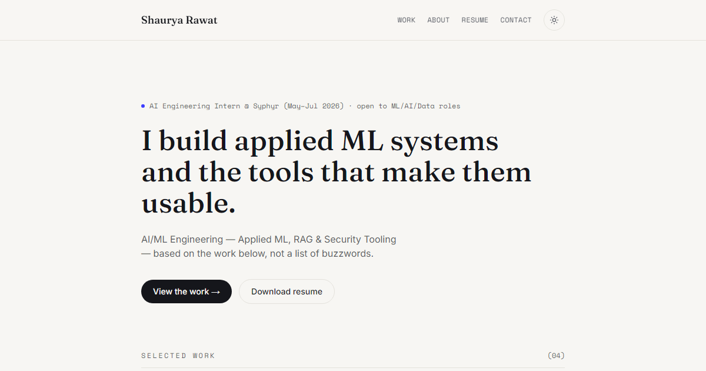

<div align="center">

# Shaurya Rawat — Portfolio

**AI/ML Engineering — Applied ML, RAG & Security Tooling**

[Live Site](https://shauryarawat29.github.io) · [GitHub](https://github.com/ShauryaRawat29) · [LinkedIn](https://linkedin.com/in/shaurya-rawat-8751922b5) · [Email](mailto:shauryarawat29@gmail.com)

</div>

<br />

<div align="center">
  
</div>

<br />

## About

B.Tech CSE (IoT) student at Amity University (2023–2027). AI Engineering Intern at Syphyr Pvt. Ltd. (May–Jul 2026). I build applied ML systems and the tools that make them usable — phishing detection, RAG pipelines, AI writing analysis, and security infrastructure.

## Featured Projects

| Project | Description | Stack | Links |
|---------|-------------|-------|-------|
| **PhishGuard** | AI-powered phishing URL detection with XGBoost, SHAP explanations, calibrated confidence. 468K URLs, 0.9973 F1, <1% adversarial evasion. | Python, XGBoost, SHAP, FastAPI, Docker, GitHub Actions, Render, Vercel | [Live](https://frontend-flame-ten-11.vercel.app/) · [Repo](https://github.com/ShauryaRawat29/phishguard-showcase) |
| **QueryDocs** | Zero-cost RAG document Q&A — upload PDF/TXT/MD/DOCX, get grounded answers with source citations. Extractive mode works with zero API keys. | Python, FastAPI, FAISS, sentence-transformers, Next.js, GitHub Actions | [Repo](https://github.com/ShauryaRawat29/querydocs) |
| **AI Essay Detector** | Evidence-based AI-writing analysis — sentence-level statistical signals (perplexity, entropy) z-scored against 6K-essay human baselines. No binary verdicts. | Python, FastAPI, Next.js, statistical NLP, ruff, mypy | [Repo](https://github.com/ShauryaRawat29/ai-essay-detector) |
| **Infrastructure & Security Engineering** | Multi-node Proxmox VE cluster (15+ VMs) with VLANs, Traefik, Loki/Prometheus/Grafana, hardening (fail2ban/nftables/auditd), vuln management (OpenVAS/Trivy/Sigma), AD security lab (Kerberos/BloodHound/MITRE ATT&CK). | Proxmox VE, Ubuntu, Docker, Linux, Networking, Prometheus, Grafana, Loki, Traefik, OpenVAS, Trivy, Sigma, Lynis, BloodHound | [Details](/work/homelab) |

## Experience

**AI Engineering Intern** — Syphyr Pvt. Ltd. (May–Jul 2026)
- Shipped 3 proof-of-concept AI applications in Python — document triage, intent classification, data extraction; 2 advanced to live client demos
- Built automated evaluation harnesses across 5+ client models, cutting manual testing effort ~30%

## Skills

**ML & AI:** Python, XGBoost, SHAP, scikit-learn, sentence-transformers, FAISS, RAG, Prompt Engineering, Statistical NLP
**Backend & Systems:** FastAPI, REST APIs, Docker, Linux, Git, GitHub Actions, pytest
**Web:** Next.js, React, TypeScript, JavaScript, HTML/CSS
**Security & Infra:** Linux hardening (fail2ban, nftables, auditd), Docker security, adversarial ML testing, vulnerability scanning (OpenVAS, Trivy), Sigma rules, CI/CD security, Kerberos, Active Directory, BloodHound, MITRE ATT&CK

## Certifications

- CS50: Introduction to Computer Science — Harvard University (edX)
- Python for Data Science — NPTEL
- Demystifying Networking — IIT Bombay
- Machine Learning Crash Course — Google
- ChatGPT Prompt Engineering for Developers — DeepLearning.AI

## Tech Stack

Built with **Astro 7** + **Tailwind CSS v4** — static output, zero client-side JS by default, content collections for projects, light/dark mode, view transitions, SEO defaults, strict TypeScript.

## Local Development

```bash
git clone https://github.com/ShauryaRawat29/ShauryaRawat29.github.io.git
cd ShauryaRawat29.github.io
npm install
npm run dev
```

Open `http://localhost:4321`.

| Command | Action |
|---------|--------|
| `npm run dev` | Start local dev server |
| `npm run build` | Type-check + build to `./dist/` |
| `npm run preview` | Preview production build locally |
| `npm run check` | Run `astro check` only |
| `npm run format` | Format with Prettier |

## Project Structure

```
├── public/
│   ├── favicon.svg
│   ├── og-image.png
│   ├── robots.txt
│   └── resume/
│       └── Shaurya-Rawat-Resume.docx
├── src/
│   ├── assets/
│   ├── components/           # BaseHead, Button, Footer, Header, SectionHeading, ThemeToggle, WorkRow
│   ├── content/
│   │   └── work/*.md         # one file per project
│   ├── layouts/
│   │   └── BaseLayout.astro
│   ├── pages/
│   │   ├── index.astro
│   │   ├── about.astro
│   │   ├── work/[id].astro
│   │   └── 404.astro
│   ├── styles/
│   │   └── global.css        # design tokens + Tailwind import
│   ├── utils/
│   │   └── formatDate.ts
│   ├── content.config.ts     # Zod schema for "work" collection
│   └── site.config.ts        # name, bio, email, social links
├── astro.config.mjs
└── tsconfig.json
```

## Customizing

**Your info.** Edit `src/site.config.ts` — name, tagline, email, phone, location, social links.

**Colors.** Edit CSS custom properties in `src/styles/global.css` (`--paper`, `--ink`, `--ink-soft`, `--signal`, `--line`).

**Fonts.** Swap families in `fonts` array in `astro.config.mjs` (Google Fonts, self-hosted).

**Projects.** Add Markdown files to `src/content/work/` with frontmatter:
```md
---
title: Project Name
summary: One sentence for list view
role: Your role
date: 2026-01-15
tags: [Python, FastAPI]
url: https://example.com # optional
repo: https://github.com/... # optional
featured: true # optional
---
Full write-up in Markdown.
```

**Open Graph image.** Replace `public/og-image.png` (1200×630).

## Deploying

Static site — deploys anywhere serving static files. Configured for GitHub Pages at `shauryarawat29.github.io`. Update `site` in `astro.config.mjs` for custom domains.

## License

MIT — free for personal or commercial use.